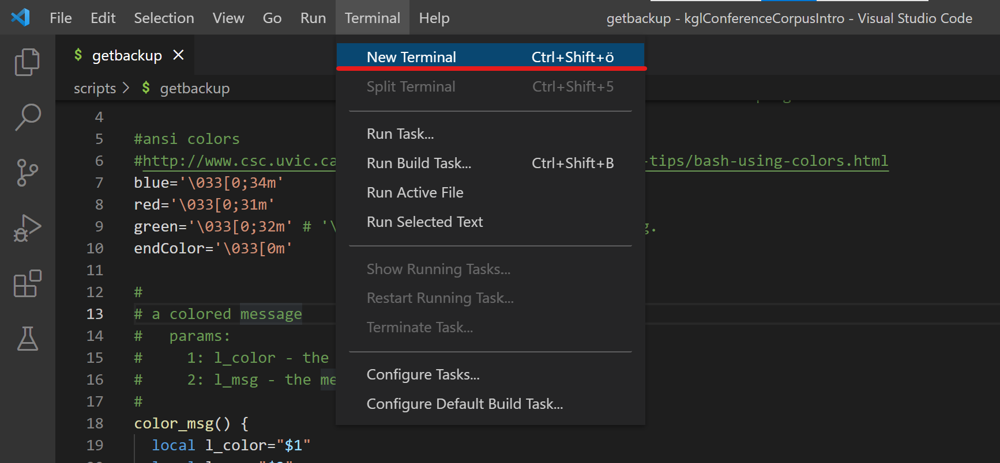
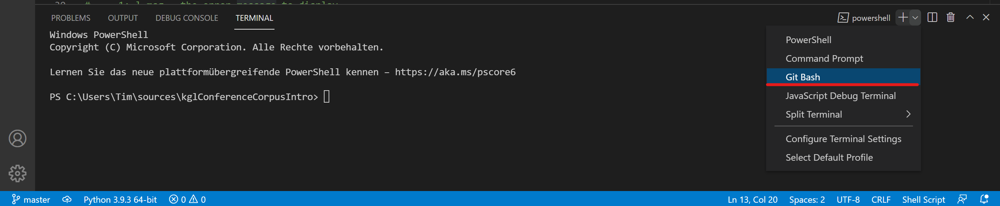
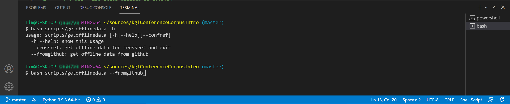
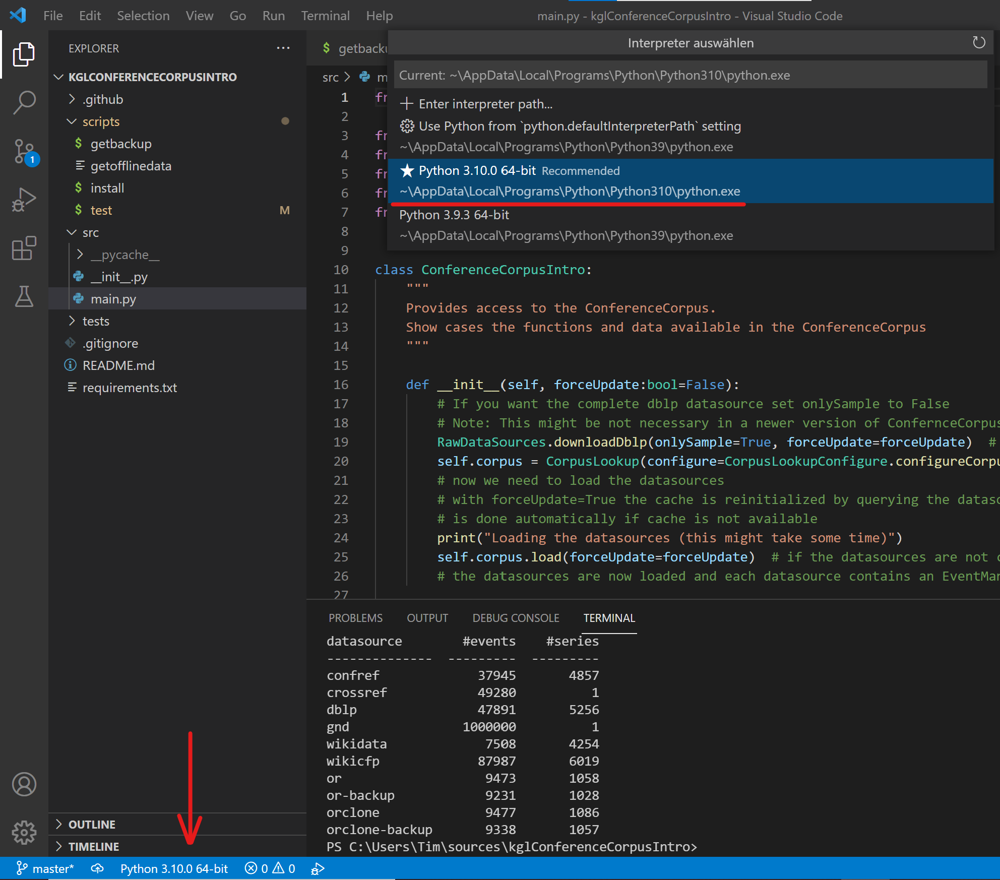
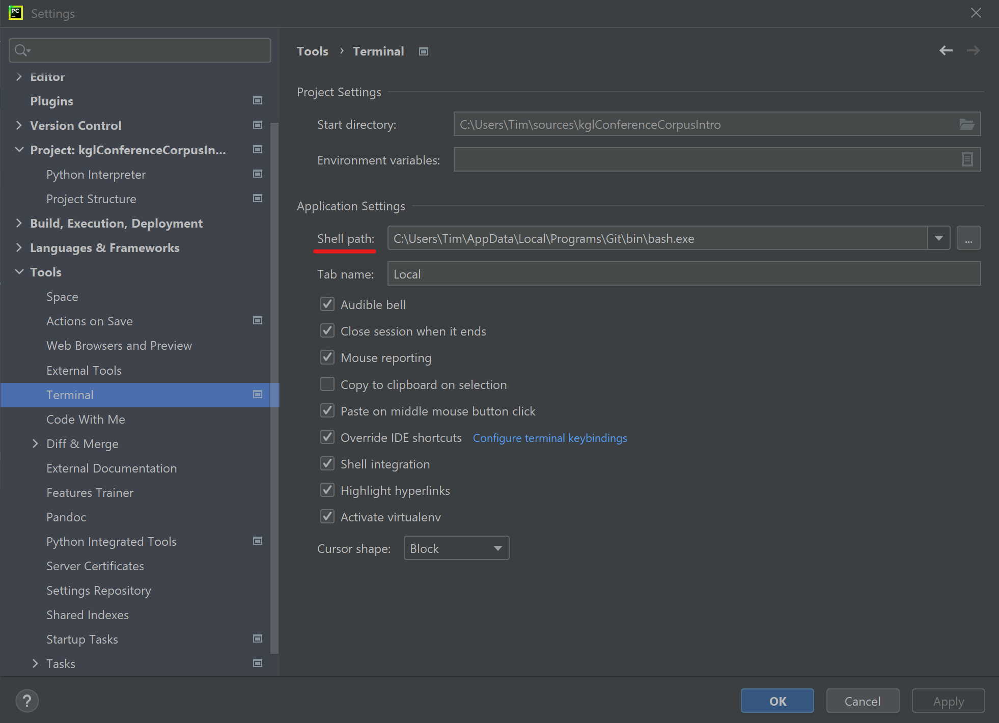
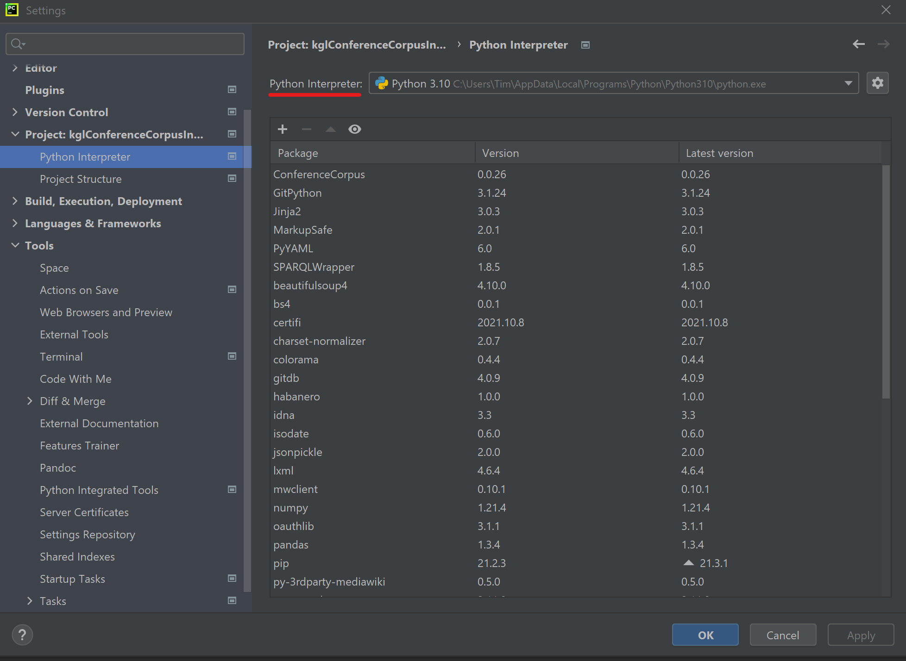

# Windows Setup

## VisualStudio Code
1) To execute the bash scripts you need to open a `New Terminal`

2) If you have [git](https://git-scm.com/) installed you should now be able to open a `Git Bash` Terminal. 

3) In this terminal you can now run the required bash-scripts

> Note: Please ensure that the python used in the bash is the same as the one used in VisualStudio Code as python interpreter. Otherwise the python modules are installed in the wrong `side-package` folder.
>  Especally if you use virtual python invironments.
> 

## PyCharm
If you have [git](https://git-scm.com/) installed you should find `bin\bash.exe` in the installation folder of `Git.
By setting this .exe as Shell path you can open a bash-terminal in the IDE. Now open a new Terminal you should see that a bash-terminal is loaded. In this terminal you can now run the required bash-scripts

>Note: PyCharm by default uses virtual environments (venv) for python so either ensure that the venv is activated in the shell or change the projects interpreter to the python environment used in the bash-terminal.
>